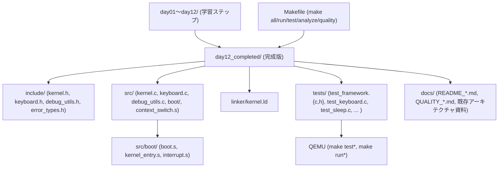
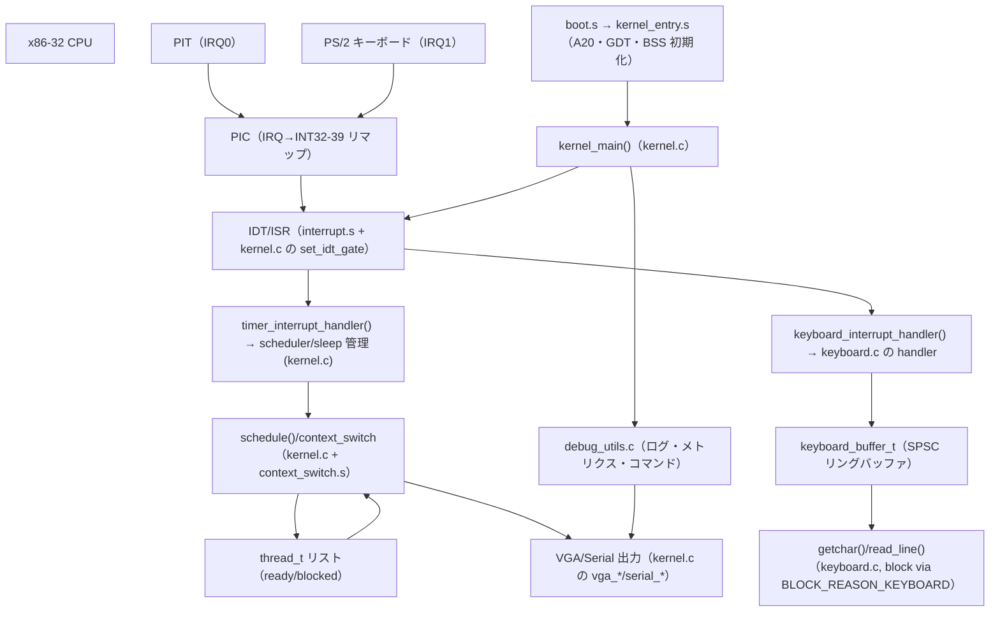

# Mini OS アーキテクチャ・コードデックス

> 📎 **参考資料（LLM 比較生成）**: 本ファイルは複数の LLM で生成したアーキテクチャ解説の比較検証用資料です。公式の正本は [`../ARCHITECTURE_ja.md`](../ARCHITECTURE_ja.md) を参照してください。内容は生成時点（day99 基準）のものです。

このドキュメントは、x86-32 教育用 OS の完成形である `day12_completed/` を軸に、リポジトリ全体の構造と実行時アーキテクチャを俯瞰するための「コード de 紙芝居」です。OS 開発の経験があるソフトウェアエンジニアが初めてこのリポジトリを見たときに、どのファイルを追えばどの関心事にたどり着けるかを整理します。

## 1. リポジトリ全体像とビルドの起点

- `day01/`〜`day12/` はカリキュラムの各ステップで、Boot → スレッド → 入力 → デバッグと順を追って OS を構築する教材。`dayXX_completed/` はそのステップ完成版です。最終的な完成形は `day12_completed/` に集中しており、本リポジトリの開発とテストはこのディレクトリを起点とします。
- 主要なビルド／テストコマンドはルートの `Makefile` に記述されています。クロスコンパイルには `i686-elf-gcc` と `nasm` を使い、QEMU を使った動的検証は `make run`/`make test*` 系で呼び出されます。

## 2. OS 実行パスと割り込み中心の制御

`day12_completed/src/` を走る OS は、BIOS → ブートローダ → カーネル → スレッドという流れで動作し、割り込みはプリエンプション／キーボード入力の両輪を担当します。下図はハードウェア、ブート、カーネルの連携を mermaid でまとめたものです。

この流れの要点：

1. **Boot → kernel_main**: `boot.s` が BIOS から起動した後、`kernel_entry.s` でスタック/データ初期化をし、C の `kernel_main` に制御を渡す。
2. **割り込み構成**: `kernel.c` で PIC をリマップして IDT を構築し、タイマー割り込みは `timer_interrupt_handler` で `sleep()`／スケジューラを呼び出す。`keyboard_interrupt_handler` は `keyboard.c` に委譲し、SPSC バッファ経由でアプリケーションスレッドを起こす。
3. **スケジューラとコンテキストスイッチ**: `schedule()` が `thread_t` の ready/blocked リスト（`kernel.h` の `kernel_context_t` 内）を操作し、`context_switch.s` がスタック/レジスタ保存と復元を行う。`sleep()` は timer handler から遅延スレッドをブロックする。
4. **キーボード API**: `getchar()`/`read_line()` は `keyboard_buffer_t` を読んで、空なら `BLOCK_REASON_KEYBOARD` でスレッドをブロックし、割り込みが文字を供給したら再開する。
5. **デバッグ・ログ**: `debug_utils.c` は e.g. `debug_log()` `metrics_...()` `debug_command_*()` でデバッグコンソールを提供し、`kernel.c` の VGA/シリアル出力を通じて状態を表示する。

## 3. コアファイルと役割解説

- `include/kernel.h`：`thread_state_t`/`thread_t`/`kernel_context_t` を定義。ready/blocked のリンクリスト、カウンタ、スケジューラロック、IDT 構造体（`idt_entry`）を一元化。
- `include/keyboard.h`：SPSC バッファのサイズ、ASCII 変換テーブル、`getchar()`/`read_line()` プロトタイプ。
- `include/debug_utils.h`・`include/error_types.h`：ログレベル、`os_result_t` による統一的エラーハンドリング、プロファイリング構造体。
- `src/kernel.c`：VGA/シリアル初期化、IDT/PIC/タイマー/割り込みマスク設定、スレッドの生成 `create_thread()`、`sleep()`/`schedule()`/`context_switch()`、デバッグ表示 `display_system_info()`。
- `src/keyboard.c`：`keyboard_buffer_t` のロックフリー操作、`convert_scancode_to_ascii()`、`keyboard_handler_c()`、高水準入力 API（`scanf_string()` を含む）。
- `src/debug_utils.c`：`debug_command_*()` 系で内蔵コマンドを処理。計測セクション `profile_section_t`、割り込み/コンテキストスイッチ/シリアル出力回数のメトリクス。
- `src/boot/` 以下：`boot.s`（MBR → A20 → GDT → カーネル読込）、`kernel_entry.s`（C 初期化、`kernel_main` 呼び出し）、`interrupt.s`（`pusha`/`popa` を使った ISR 共通エントリ）。
- `linker/kernel.ld`：セクション配置（重複なく 1MB から）、スタック/データ/バッファ領域のレイアウト。
- `tests/`：`test_framework` が QEMU 上でシリアル出力を検査。`test_timer`/`test_interrupt`/`test_thread` などが割り込みやスリープ、キーボード API の侵食をチェック。

## 4. テストと品質ゲート

- `make test` は `tests/` 下の `test_*.o` を組み込み、QEMU で実行してシリアルログを比較。各テストが割り込み・スレッド・キーボード・PIC・シリアルの機能を独立検証する。
- `make analyze` `make quality` は clang/static analyzer や magic number/長い関数検出のパイプラインを通す。`docs/QUALITY_claude_ja.md` `docs/QUALITY_gpt_ja.md` に報告書が残る。
- テストのスタブ `tests/mock_hardware.c` は IRQ 発生の擬似化、`test_entry.s` は `interrupt.s` を使った統合テストの開始点。

## 5. 初めて見るときの最短ルート

1. `day12_completed/src/kernel.c` の `kernel_main`（イニシャライズ）→ `timer_interrupt_handler`/`schedule` までを追うことでスケジューラと割り込み構造が把握できる。
2. `day12_completed/src/keyboard.c` で SPSC バッファと `read_line` の流れ、割り込みからブロック解除までのデータ経路をチェック。
3. `day12_completed/include/kernel.h` を読んで thread/`kernel_context_t` のレイアウトを確認し、`context_switch.s`（同ディレクトリ）との橋渡しを理解。
4. `tests/test_*` を一つビルドして QEMU で動かし、シリアル出力の検証手順を掴む（`make test_keyboard` などが早い）。

このドキュメントをベースに各ディレクトリへ掘り下げれば、コードベースを速やかに理解できます。
