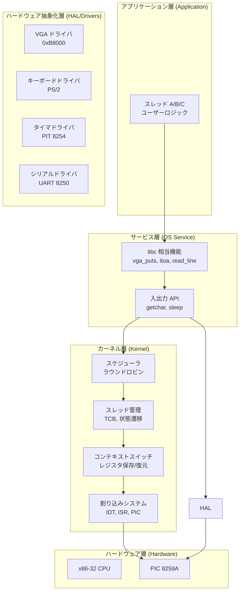
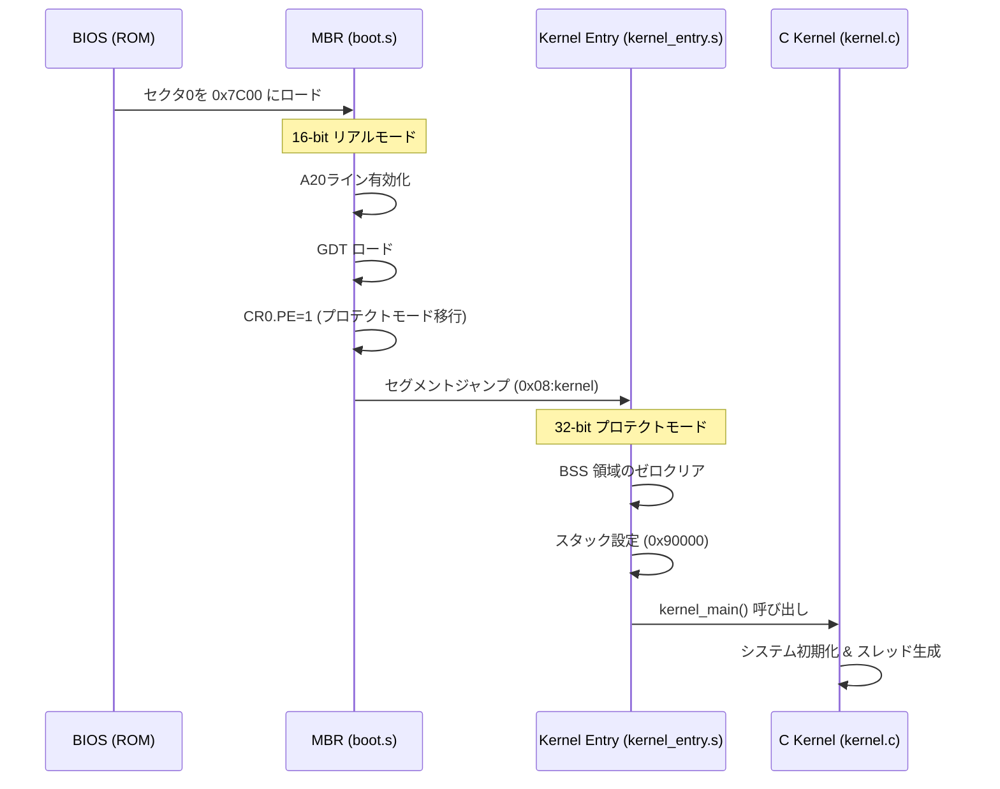
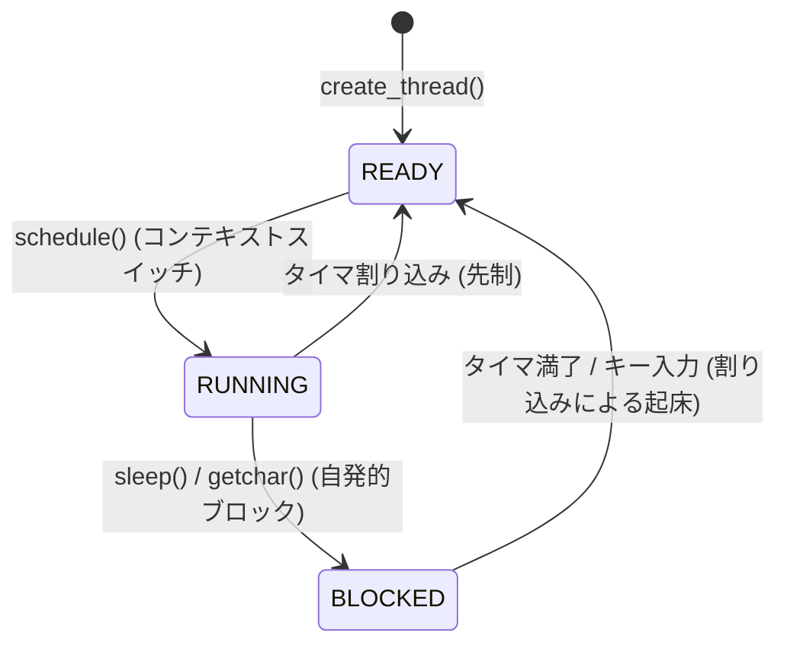
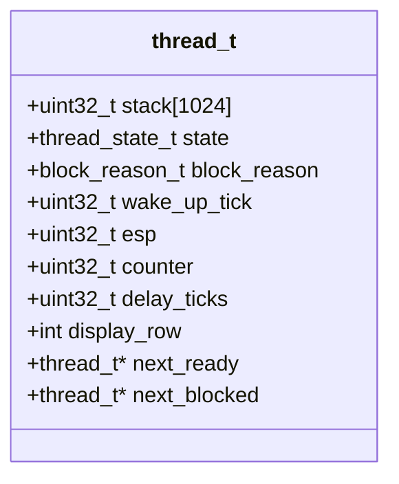
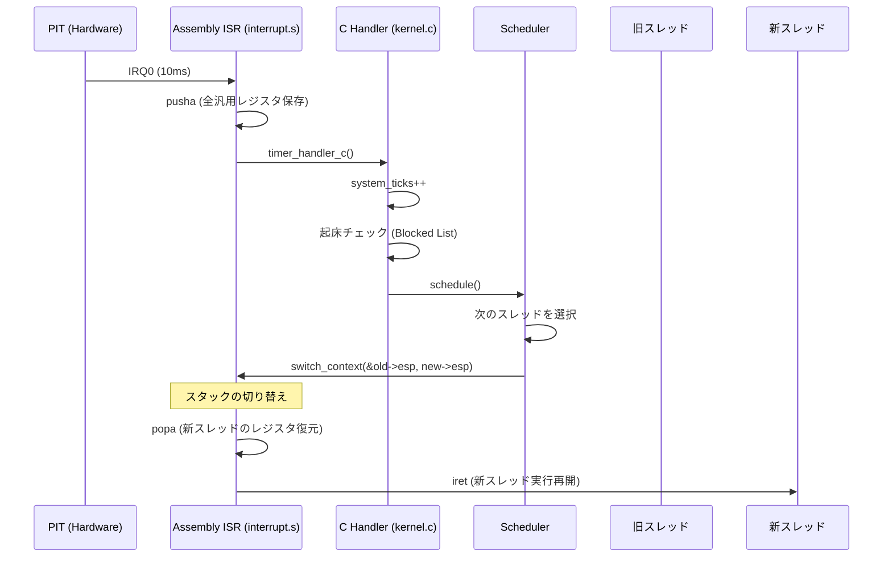
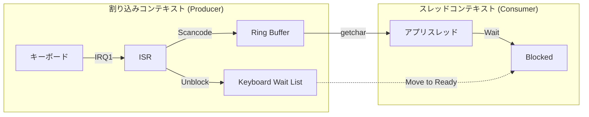

# Mini OS 詳細アーキテクチャガイド

> 📎 **参考資料（LLM 比較生成）**: 本ファイルは Gemini により生成されたアーキテクチャ解説の比較検証用資料です。公式の正本は [`../ARCHITECTURE_ja.md`](../ARCHITECTURE_ja.md) を参照してください。内容は生成時点（day99 基準）のものです。

本ドキュメントは、Mini OS の設計、内部構造、および動作原理を、維持管理（メンテナ）向けに詳細に解説するものです。

## 1. システム全体俯瞰

Mini OS は、モノリシックな構造を持つ 32-bit x86 プロテクトモード OS です。ハードウェア抽象化、割り込み管理、スレッドスケジューリング、および基本デバイスドライバ（VGA, キーボード, シリアル）を提供します。

### 1.1 モジュール構成図

## 2. 起動シーケンス (Boot Sequence)

BIOS からカーネル実行までの流れ。リアルモードから 32bit プロテクトモードへの移行が含まれます。

## 3. スレッド管理とスケジューリング

### 3.1 スレッド状態遷移図 (Thread State Transition)

Mini OS は READY, RUNNING, BLOCKED の 3 状態を持ちます。

### 3.2 スレッド制御ブロック (TCB)

`thread_t` 構造体はスレッドの全状態を保持します。

## 4. 割り込みとコンテキストスイッチ

タイマ割り込み（IRQ0）を契機としたコンテキストスイッチの流れ。

## 5. キーボード入力システム

PS/2 キーボードからの入力は、割り込み駆動と SPSC リングバッファを使用してスレッドセーフに処理されます。

## 6. メモリマップ (Memory Layout)

Mini OS はセグメンテーション（フラットモデル）を使用し、ページングは未実装です。

| アドレス範囲   | 用途         | 説明                             |
| :------------- | :----------- | :------------------------------- |
| `0x00007C00`   | MBR          | ブートローダのロード位置         |
| `0x00010000`   | Kernel       | カーネルイメージ実行領域         |
| `0x00090000`   | Kernel Stack | カーネル初期化用スタック         |
| `0x000B8000`   | VGA Buffer   | テキストモード表示メモリ (80x25) |
| `Thread Stack` | 各スレッド   | 4KB 単位の独立したスタック       |

## 7. 維持管理上の注意点 (Maintainer Notes)

1. **スタックアライメント**: スレッド生成時の初期スタックレイアウトは `interrupt.s` の `switch_context` と厳密に一致させる必要があります。
2. **割り込み禁止**: `schedule()` やリスト操作などのクリティカルセクションでは、割り込み状態の管理に注意してください。
3. **IOポート**: ハードウェア制御には `inb`/`outb` 系のインラインアセンブリを使用しています。
4. **テスト**: 変更後は `make test` を実行し、回帰テストをパスすることを確認してください。
