# Mini OS アーキテクチャ詳細解説 (Mermaidチャート付き)

> 📎 **参考資料（LLM 比較生成）**: 本ファイルは GLM により生成されたアーキテクチャ解説（Mermaid チャート付き）の比較検証用資料です。公式の正本は [`../ARCHITECTURE_ja.md`](../ARCHITECTURE_ja.md) を参照してください。内容は生成時点（day99 基準）のものです。

## 📋 概要

このドキュメントは、教育用x86 32-bitマルチスレッドオペレーティングシステム「Mini OS」のアーキテクチャを、Software Engineer向けにMermaidチャートを交えて詳細に解説します。

## 🏗️ 全体システムアーキテクチャ

```mermaid
graph TB
    subgraph "ハードウェア層"
        CPU[x86 CPU]
        RAM[物理メモリ]
        PIC[PIC 8259A]
        PIT[PIT 8254]
        KB[PS/2 Keyboard]
        VGA[VGA Display]
    end

    subgraph "ブート層"
        BIOS[BIOS/UEFI]
        BOOT[Boot Sector<br/>boot.s]
        ENTRY[Kernel Entry<br/>kernel_entry.s]
    end

    subgraph "カーネル層"
        IDT[IDT割り込みテーブル]
        GDT[GDTセグメントテーブル]
        KERNEL[kernel.c]
        SCHED[スケジューラ]
        TCB[スレッド管理]
    end

    subgraph "ドライバ層"
        TIMER[タイマードライバ]
        KBD[キーボードドライバ]
        VGA_DRV[VGAドライバ]
        SERIAL[シリアルドライバ]
    end

    subgraph "システムコール層"
        SLEEP[sleep()]
        GETC[getchar()]
        PRINT[printf()]
    end

    BIOS --> BOOT
    BOOT --> ENTRY
    ENTRY --> KERNEL

    CPU -.->|割り込み| PIC
    PIC -.->|IRQ0/PIT| TIMER
    PIC -.->|IRQ1/KB| KBD
    TIMER --> SCHED
    SCHED --> TCB
    KBD --> TCB

    KERNEL --> VGA_DRV
    KERNEL --> SERIAL
    VGA_DRV --> VGA
    SERIAL --> RAM

    TCB --> SLEEP
    TCB --> GETC
    KERNEL --> PRINT
```

## 🚀 ブートプロセス詳細

### フェーズ1: 16-bitリアルモードブート

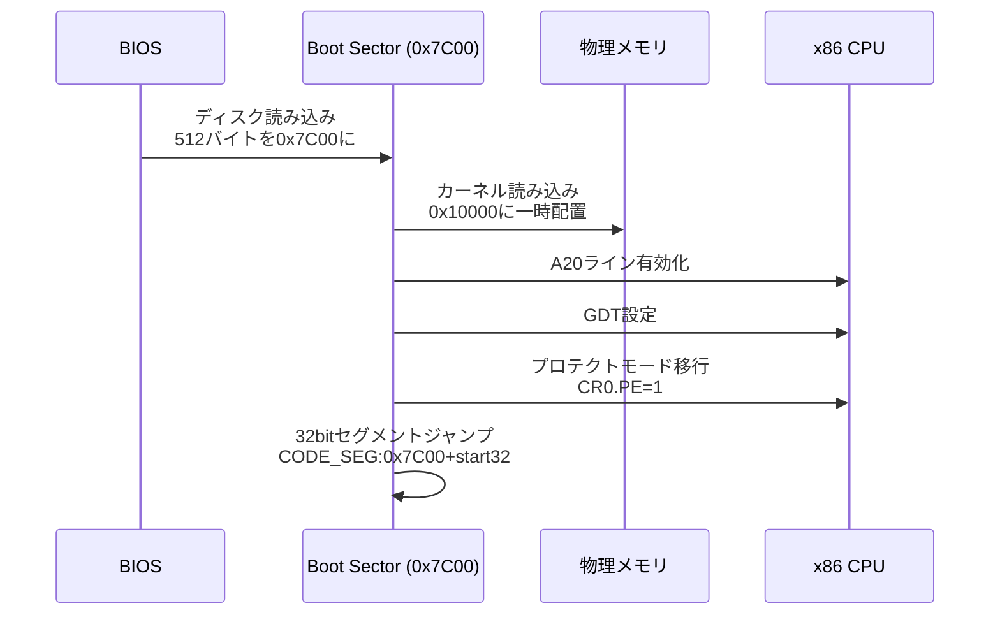

### フェーズ2: 32-bitプロテクトモード移行

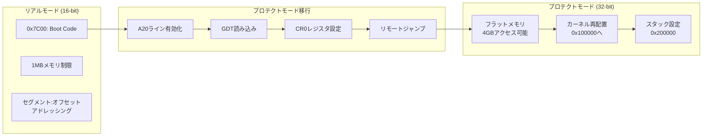

### フェーズ3: カーネルエントリー

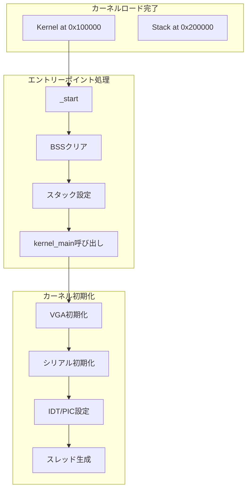

## 💾 メモリアーキテクチャ

### 物理メモリ配置

```mermaid
graph TB
    subgraph "物理メモリマップ (4GB)"
        MEM0[0x00000000<br/>IVT/BIOSデータ]
        MEM1[0x00007C00<br/>ブートセクタ]
        MEM2[0x000A0000<br/>VGAメモリ]
        MEM3[0x000B8000<br/>テキストバッファ]
        MEM4[0x00100000<br/>カーネルコード]
        MEM5[0x00200000<br/>カーネルスタック]
        MEM6[0x00300000<br/>スレッドスタック]
        MEM7[0x00400000<br/>空き領域...]
        MEM8[0xFFFFFFFF<br/>終端]
    end

    subgraph "カーネルメモリ詳細"
        K1[0x100000-0x1FFFFF<br/>Kernel Code (1MB)]
        K2[0x200000-0x2FFFFF<br/>Kernel Stack (1MB)]
        K3[0x300000-<br/>Thread Stacks<br/>4KB × MAX_THREADS]
    end

    MEM4 --> K1
    MEM5 --> K2
    MEM6 --> K3
```

### GDT（グローバルディスクリプタテーブル）

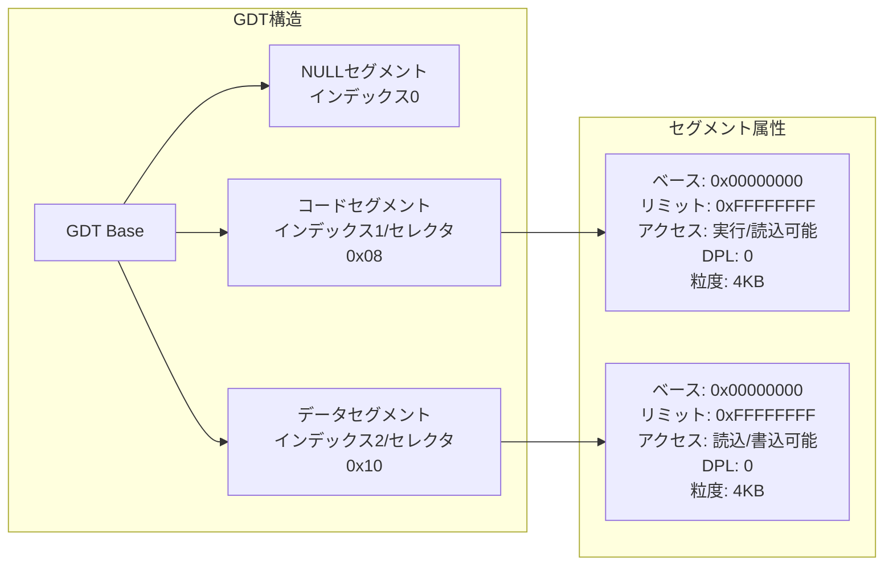

## ⚡ 割り込みシステムアーキテクチャ

### 割り込み処理フロー全体

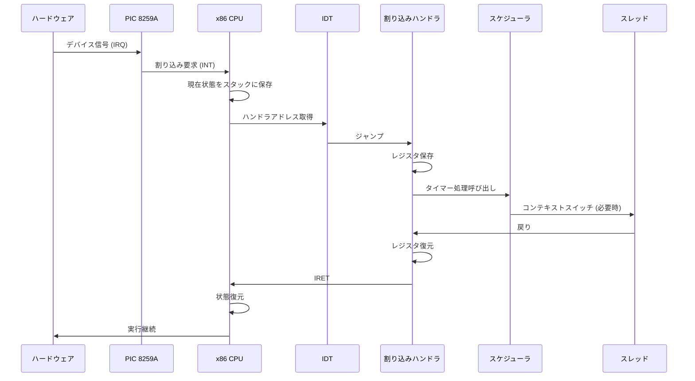

### IDT（割り込みディスクリプタテーブル）

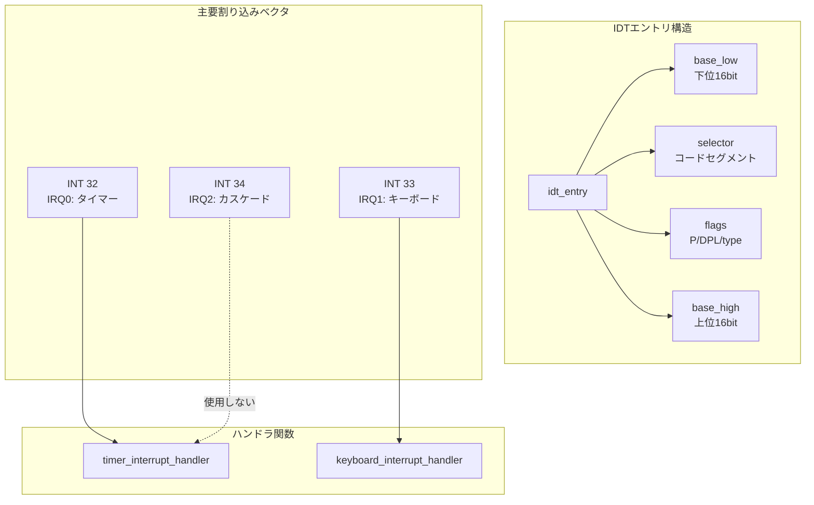

### PIC（プログラマブル割り込みコントローラ）

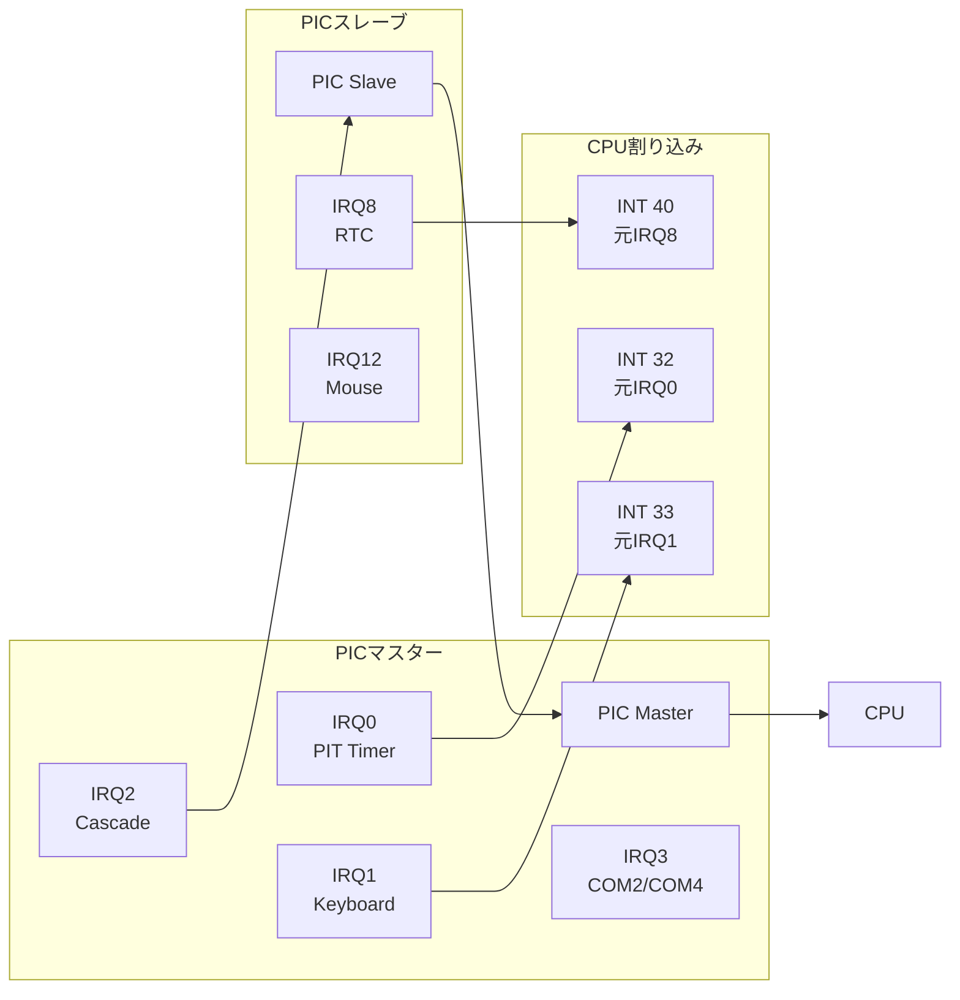

## 🧵 スレッド管理アーキテクチャ

### スレッド制御ブロック（TCB）

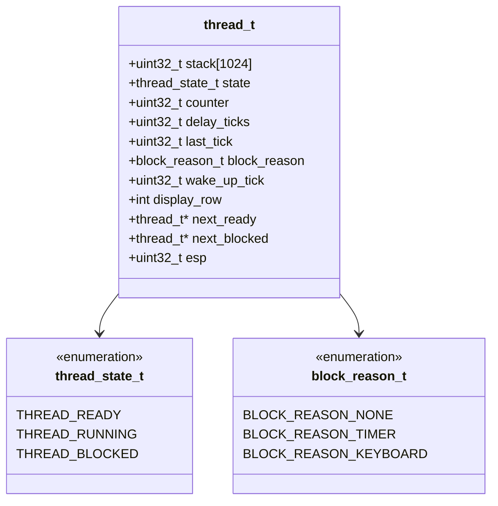

### スレッド状態遷移

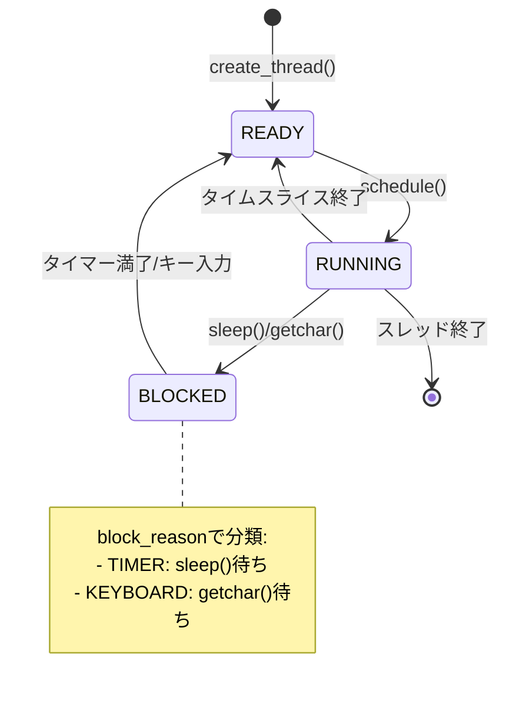

### スケジューラロジック

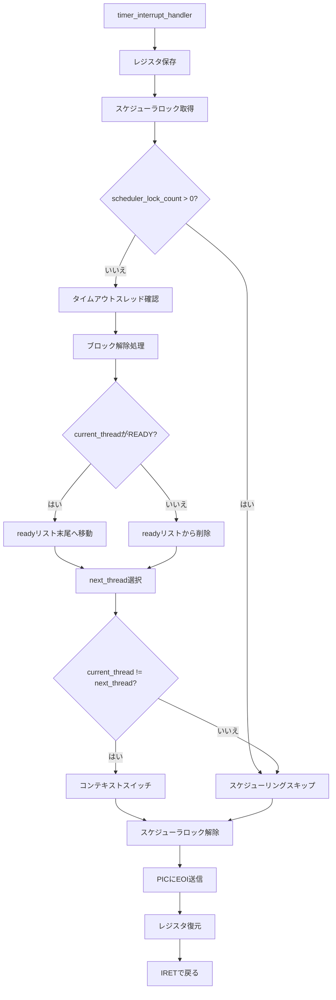

### コンテキストスイッチ詳細

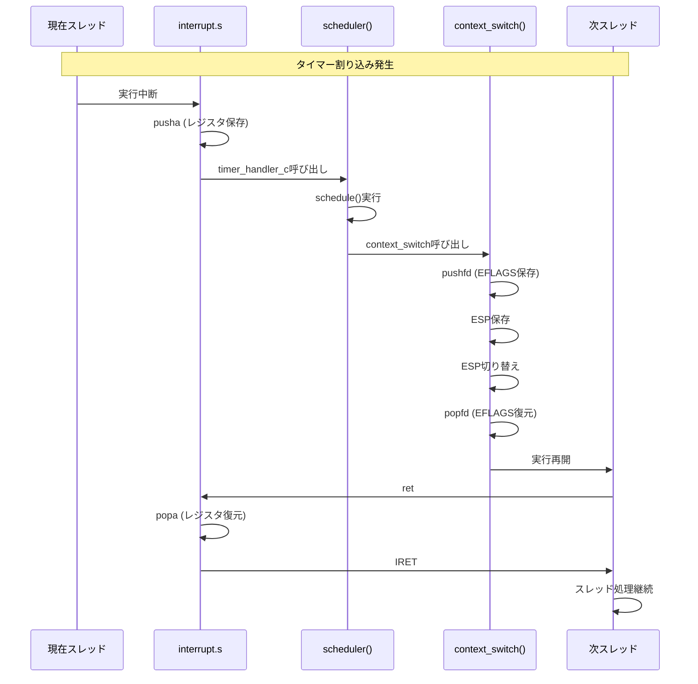

## 🎯 タイマーシステム詳細

### PIT（プログラマブル間隔タイマー）

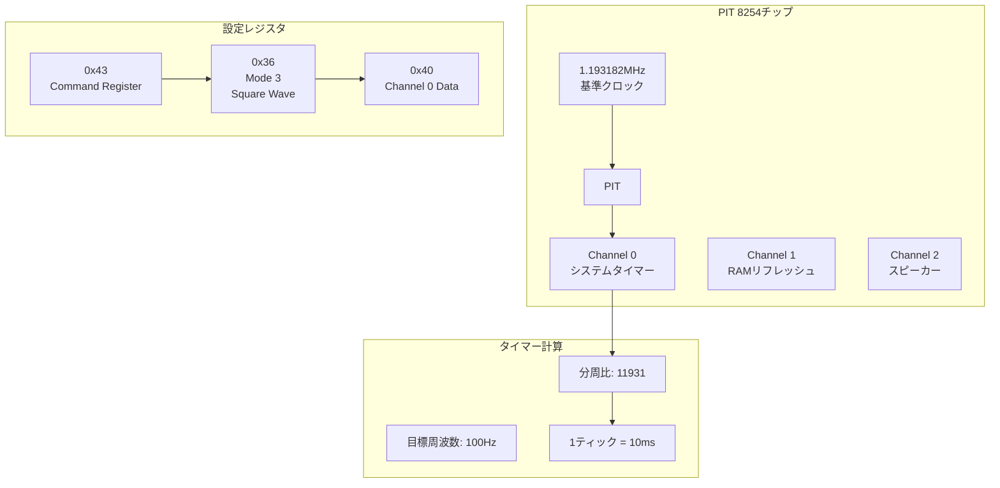

### タイマー割り込み処理

```mermaid
flowchart TD
    IRQ[timer_interrupt_handler] --> CALL_ASM[アセンブリ処理]
    CALL_ASM --> CALL_C[timer_handler_c]

    CALL_C --> INC_TICK[system_ticks++]
    INC_TICK --> CHECK_TIMER[タイムアウトスレッド確認]

    CHECK_TIMER --> LOOP{blockedリスト巡回}
    LOOP -->|スレッドあり| CHECK_WAKE{wake_up_tick <= system_ticks?}
    CHECK_WAKE -->|はい| UNBLOCK[ブロック解除]
    CHECK_WAKE -->|いいえ| CONTINUE[次スレッドへ]
    UNBLOCK --> READY[READYリストへ追加]

    CONTINUE --> LOOP
    LOOP -->|リスト終了| SCHEDULE[schedule()呼び出し]
    READY --> SCHEDULE

    SCHEDULE --> EOI[PIC_EOI送信]
    EOI --> RETURN[ハンドラ終了]
```

## ⌨️ キーボードシステム詳細

### PS/2キーボードアーキテクチャ

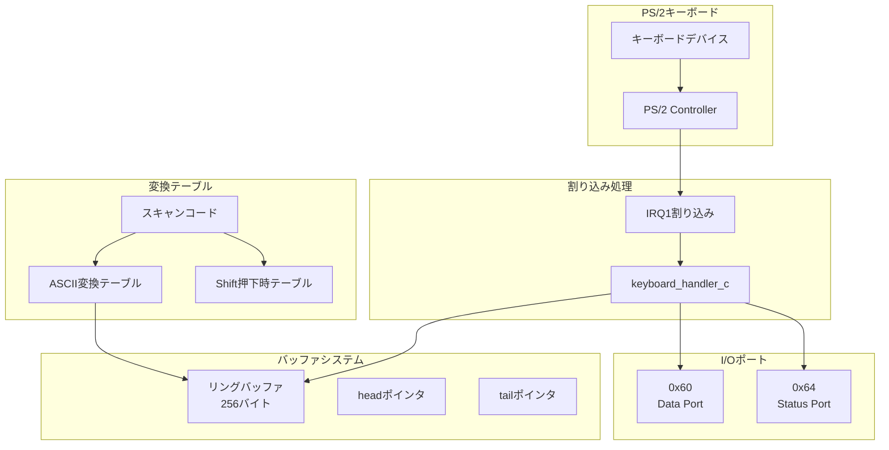

### キーボードバッファ詳細

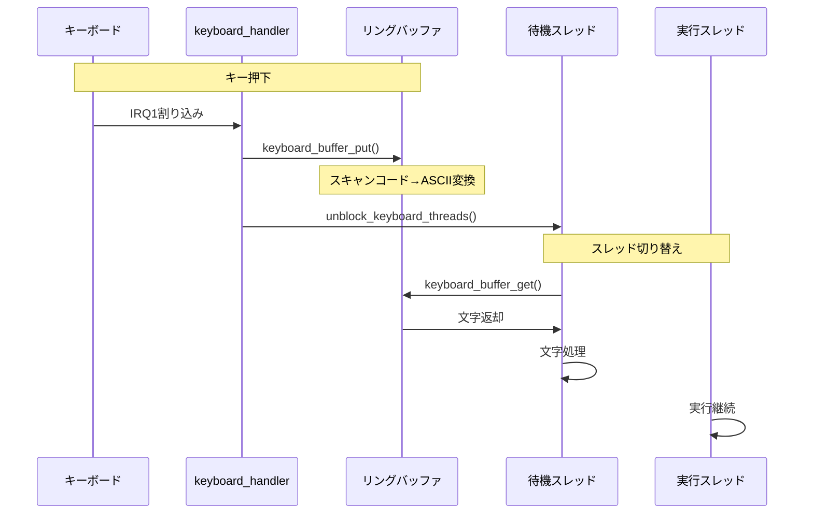

### キーボード入力API

```mermaid
graph LR
    subgraph "ユーザーAPI"
        GETC[getchar()]
        READS[read_line()]
        SCANF[scanf_char()]
    end

    subgraph "内部処理"
        BLOCK[block_current_thread<br/>BLOCK_REASON_KEYBOARD]
        CHECK[keyboard_buffer_is_empty()]
        UNBLOCK[unblock_keyboard_threads()]
    end

    subgraph "バッファ操作"
        PUT[keyboard_buffer_put]
        GET[keyboard_buffer_get]
    end

    GETC --> BLOCK
    READS --> BLOCK
    SCANF --> BLOCK

    BLOCK --> CHECK
    CHECK -->|空| UNBLOCK
    UNBLOCK --> GET

    ISR割り込み --> PUT
```

## 🖥️ VGA表示システム

### VGAテキストモード詳細

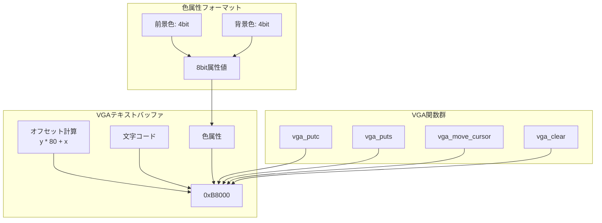

### デバッグ表示システム

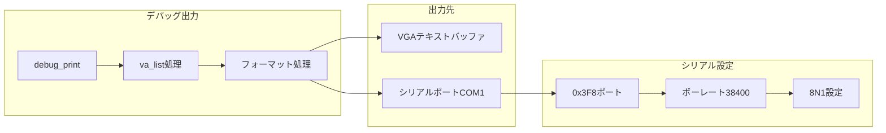

## 🔧 ビルドシステム

### Makefileターゲット依存関係

```mermaid
graph TD
    ALL[all]
    RUN[run]
    TEST[test]
    CLEAN[clean]

    subgraph "ビルドターゲット"
        KERNEL[kernel.bin]
        BOOT[boot.bin]
        IMAGE[os.img]
    end

    subgraph "ソースファイル"
        BOOT_S[src/boot/boot.s]
        ENTRY_S[src/boot/kernel_entry.s]
        INT_S[src/boot/interrupt.s]
        KERNEL_C[src/kernel.c]
        KBD_C[src/keyboard.c]
    end

    ALL --> KERNEL
    KERNEL --> BOOT
    KERNEL --> IMAGE

    BOOT --> BOOT_S
    KERNEL --> ENTRY_S
    KERNEL --> INT_S
    KERNEL --> KERNEL_C
    KERNEL --> KBD_C

    RUN --> ALL
    TEST --> ALL
    CLEAN --> -.->|削除| KERNEL
    CLEAN --> -.->|削除| IMAGE
```

### ツールチェーン構成

```mermaid
graph TB
    subgraph "開発ツール"
        GCC[i686-elf-gcc<br/>クロスコンパイラ]
        NASM[nasm<br/>アセンブラ]
        LD[i686-elf-ld<br/>リンカ]
        QEMU[qemu-system-i386<br/>エミュレータ]
    end

    subgraph "ビルドプロセス"
        SRC[ソースコード]
        OBJ[オブジェクトファイル]
        BIN[バイナリイメージ]
        IMG[ディスクイメージ]
    end

    subgraph "実行環境"
        BOOT[ブートローダ]
        KERNEL[カーネル]
        OS[Mini OS]
    end

    SRC --> GCC
    SRC --> NASM
    GCC --> OBJ
    NASM --> OBJ
    OBJ --> LD
    LD --> BIN
    BIN --> IMG

    IMG --> QEMU
    QEMU --> BOOT
    BOOT --> KERNEL
    KERNEL --> OS
```

## 🎓 教育的価値と学習ポイント

### OS開発の主要概念

このMini OSは、以下の重要なOS概念を実践的に学習できます：

1. **ブートプロセス**: BIOS→ブートローダ→カーネルの連携
2. **メモリ管理**: フラットメモリモデル、スタック管理
3. **割り込み処理**: ハードウェア割り込み、IDT、PIC
4. **マルチスレッド**: スケジューリング、コンテキストスイッチ
5. **デバイスドライバ**: タイマー、キーボード、VGA
6. **システムコール**: ユーザーAPIの実装

### Software Engineerへの応用

```mermaid
mindmap
  root((Mini OS学習))
    低レベル理解
      CPUアーキテクチャ
      メモリ管理
      割り込み機構
    システム設計
      レイヤ化アーキテクチャ
      モジュール化
      並行処理
    デバッグスキル
      ハードウェアデバッグ
      シリアル出力活用
      QEMU活用
    パフォーマンス理解
      コンテキストスイッチ
      割り込みレイテンシ
      メモリアクセス
```

### 実践的な開発スキル

1. **クロスコンパイル環境**: ターゲットとホストの分離
2. **アセンブリ言語**: Cとの連携、インラインアセンブリ
3. **メモリレイアウト設計**: リンカスクリプト、アドレス配置
4. **割り込み駆動設計**: イベントベースプログラミング
5. **状態機械設計**: スレッド状態遷移
6. **リングバッファ**: 生産者-消費者パターン

## 📊 パフォーマンス特性

### タイミング分析

```mermaid
gantt
    title タイムライン分析（1秒間）
    dateFormat X
    axisFormat %s

    section スレッド実行
    ThreadA : 0, 100ms
    ThreadB : 100ms, 100ms
    ThreadC : 200ms, 100ms
    ThreadA : 300ms, 100ms

    section 割り込み
    Timer IRQ : 0, 10ms
    Timer IRQ : 10ms, 10ms
    Timer IRQ : 20ms, 10ms
    Timer IRQ : 30ms, 10ms

    section コンテキストスイッチ
    Switch A→B : active, 50ms
    Switch B→C : 100ms, 150ms
    Switch C→A : 200ms, 250ms
```

### リソース使用状況

- **メモリ使用**: 約2MB（カーネル + スタック）
- **CPU使用率**: 100%（バックグラウンドタスク含む）
- **割り込み頻度**: 100Hz（10ms間隔）
- **コンテキストスイッチ時間**: 約50-100クロックサイクル

## 🚀 拡張可能性

### 将来的な機能拡張

```mermaid
graph TB
    subgraph "現在の機能"
        CURRENT[マルチスレッド]
        TIMER[タイマー]
        KBD[キーボード]
        VGA[VGA表示]
    end

    subgraph "拡張機能候補"
        MEM[メモリ管理<br/>ページング]
        FS[ファイルシステム<br/>FAT32]
        NET[ネットワーク<br/>TCP/IP]
        USER[ユーザーモード<br/>システムコール]
        SMP[マルチコア<br/>SMP対応]
    end

    CURRENT --> MEM
    CURRENT --> FS
    CURRENT --> NET
    CURRENT --> USER
    CURRENT --> SMP
```

## 📝 まとめ

このMini OSは、教育用として設計されたx86 32-bitオペレーティングシステムであり、以下の特徴を持っています：

1. **完全な実装**: ブートからアプリケーション層まで
2. **実践的アーキテクチャ**: 現代OSの基本概念を網羅
3. **クリーンな設計**: モジュール化された構造
4. **豊富なドキュメント**: 学習者が理解しやすい解説
5. **拡張性**: 将来の機能追加が容易

Software Engineerがこのコードベースを学ぶことで、コンピュータシステムの根本的な理解を深め、より高度なシステム開発に必要な知識を習得できます。

---

*このドキュメントは、Mini OSのアーキテクチャをMermaidチャートと共に詳細に解説しました。コードの具体的な実装については、ソースコードと各種READMEを参照してください。*